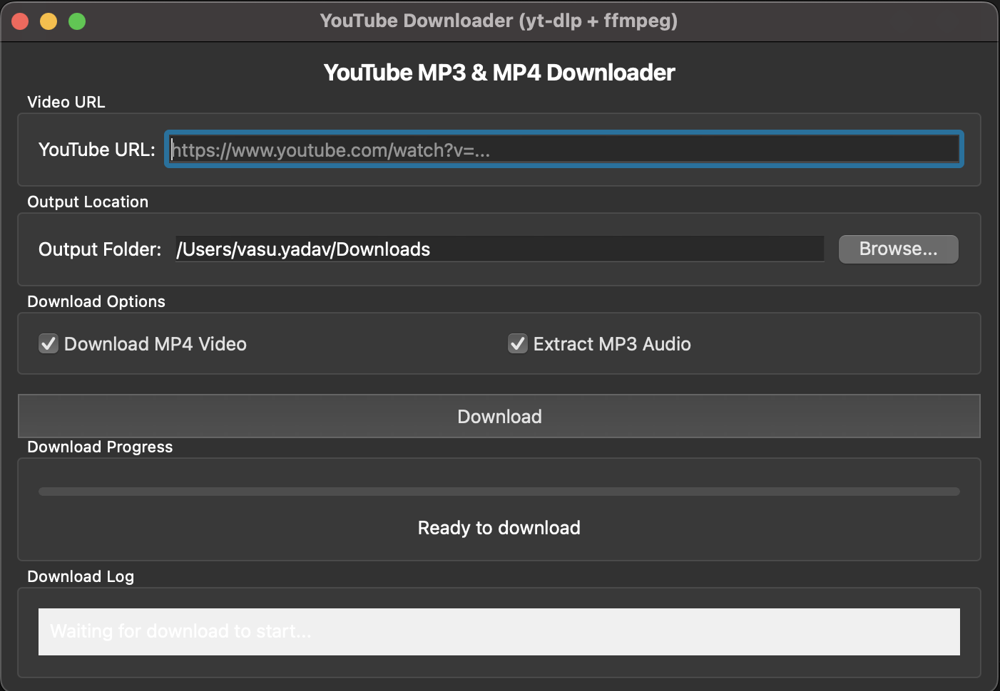

# YouTube Downloader

A Python-based YouTube downloader that allows you to download videos in MP4 format and extract MP3 audio. The application uses yt-dlp and ffmpeg for efficient and reliable downloads.

## Features

- Download YouTube videos in MP4 format
- Extract MP3 audio from videos
- GUI interface for easy use
- Command-line interface for automation
- Progress tracking during downloads
- Support for custom download locations
- Error handling and dependency checking

## Screenshots



## Requirements

- Python 3.6+
- yt-dlp
- ffmpeg
- PyQt5 (for GUI version)

## Installation

### 1. Clone the repository

```bash
git clone https://github.com/Vasu-yadav/YoutubeDownloader.git
cd YoutubeDownloader
```

### 2. Install Python dependencies

```bash
pip install -r requirements.txt
```

### 3. Install external dependencies

#### On macOS (using Homebrew)

```bash
brew install yt-dlp ffmpeg
```

#### On Ubuntu/Debian

```bash
sudo apt update
sudo apt install ffmpeg
pip install yt-dlp
```

#### On Windows

- Install [FFmpeg](https://ffmpeg.org/download.html) and add it to your PATH
- Install yt-dlp via pip:
  ```
  pip install yt-dlp
  ```

## Usage

### GUI Version

Run the graphical user interface:

```bash
python youtube_downloader_ytdlp_gui.py
```

1. Enter the YouTube video URL
2. Select the output folder
3. Choose download options (MP4 video, MP3 audio, or both)
4. Click Download

### Command-line Version

```bash
python youtube_downloader_ytdlp.py <youtube_url> [output_folder]
```

Example:
```bash
python youtube_downloader_ytdlp.py https://www.youtube.com/watch?v=dQw4w9WgXcQ my_downloads
```

## Troubleshooting

### Common Issues

1. **Dependency Errors**: Make sure both yt-dlp and ffmpeg are installed and accessible in your PATH
2. **Permission Issues**: Ensure you have write permissions for the output directory
3. **Network Issues**: Check your internet connection if downloads fail or are slow

### Updating Dependencies

Keep yt-dlp up to date for the best compatibility with YouTube:

```bash
pip install -U yt-dlp
```

## License

This project is licensed under the MIT License - see the LICENSE file for details.

## Acknowledgments

- [yt-dlp](https://github.com/yt-dlp/yt-dlp) - The YouTube download library
- [ffmpeg](https://ffmpeg.org/) - Media processing library
- [PyQt5](https://www.riverbankcomputing.com/software/pyqt/) - GUI framework